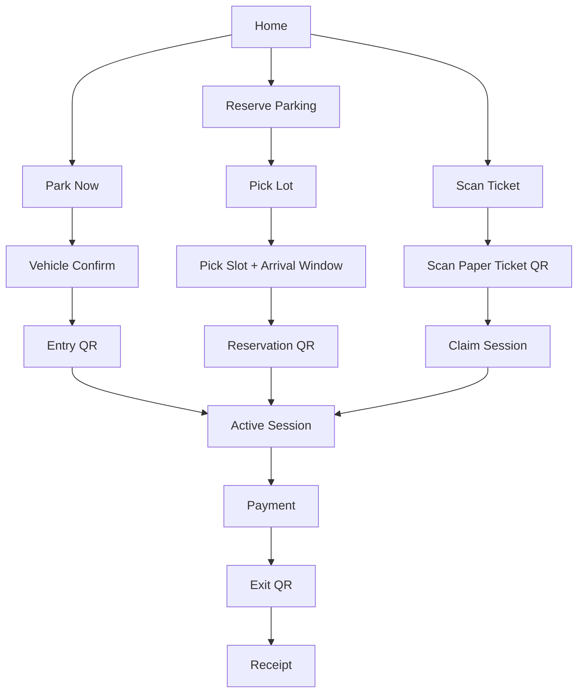

# Parking App Home Redesign Plan

## Goal

Redesign the mobile app so the experience is organized around the user's parking intent instead of around lot browsing.

The home screen should answer one question immediately:

- What do you want to do right now?

The three primary intents are:

- `Park Now`
- `Reserve Parking`
- `Scan Ticket`

These three intents should become the top-level information architecture of the customer app.

## Product Direction

### Core principle

The start of each flow is different, but the end of each flow should feel shared:

- `Entry access`
- `Active parking session`
- `Payment`
- `Exit QR`
- `Receipt`

### Rename recommendation

Use `Park Now` in the UI instead of `Walk-In Parking`.

Reason:

- `Park Now` is user language
- `Walk-In` sounds operational/internal
- `Park Now` pairs better with `Reserve Parking` and `Scan Ticket`

## Current Route Reuse

These routes already map well to the new flow system:

- `/home`
- `/explore`
- `/walkin-confirm`
- `/walkin-qr`
- `/reservation/[lotId]`
- `/arrival`
- `/session`
- `/payment`
- `/payment-success`
- `/exit`
- `/receipt`

## New Route Recommendation

Add one new first-class customer flow for traditional ticket users:

- `/scan-ticket`

Optional split if needed later:

- `/scan-ticket`
- `/scan-ticket/confirm`

Today, `/validate` behaves like a redirect and is not a real user-facing "claim paper ticket" flow.

## Home Screen Information Architecture

### Priority order

1. Current parking status
2. Three primary actions
3. Nearby parking locations
4. Supportive content

### Dynamic hero behavior

The top card should change based on `useParkingFlowStore` state.

#### Hero state: nothing active

- Title: `Ready to park?`
- Body: `Choose how you want to start.`
- CTA row:
- `Park Now`
- `Reserve`
- `Scan Ticket`

#### Hero state: walk-in entry pass created

- Title: `Entry QR ready`
- Body: `Show your Park Now QR at the gate.`
- Primary CTA: `Open QR`
- Secondary CTA: `Cancel`

#### Hero state: reservation created

- Title: `Reservation confirmed`
- Body: `Slot A12 is held until 3:30 PM.`
- Primary CTA: `Open Entry QR`
- Secondary CTA: `View Reservation`

#### Hero state: active session

- Title: `Parking in progress`
- Body: running timer + location + running fee
- Primary CTA: `Open Session`
- Secondary CTA: `Pay when ready`

#### Hero state: payment pending

- Title: `Complete payment`
- Body: `Finish payment to unlock your exit QR.`
- Primary CTA: `Continue Payment`

#### Hero state: exit ready

- Title: `Exit QR ready`
- Body: `Present your QR at the exit gate.`
- Primary CTA: `Open Exit QR`

#### Hero state: recent receipt only

- Title: `Trip completed`
- Body: `View your latest receipt.`
- Primary CTA: `Open Receipt`

## Proposed Home Wireframe

```text
+--------------------------------------------------+
| ParkingPH                              Profile   |
| Good afternoon, Carlo                           |
| You have no active parking task                 |
+--------------------------------------------------+
| HERO STATUS CARD                                |
| Ready to park?                                  |
| Choose how you want to start.                   |
| [ Park Now ] [ Reserve ] [ Scan Ticket ]        |
+--------------------------------------------------+
| PRIMARY ACTIONS                                 |
| +--------------------------------------------+  |
| | Park Now                                  |  |
| | Get an entry QR in seconds                |  |
| | Best for drivers already at the parking   |  |
| +--------------------------------------------+  |
| +--------------------------------------------+  |
| | Reserve Parking                           |  |
| | Pick a slot and arrival window            |  |
| | Best for planned trips                    |  |
| +--------------------------------------------+  |
| +--------------------------------------------+  |
| | Scan Ticket                               |  |
| | Claim a paper-ticket session and pay here |  |
| | Best for traditional parking users        |  |
| +--------------------------------------------+  |
+--------------------------------------------------+
| NEARBY PARKING                                  |
| Search or browse lots                           |
| [ list of nearby lots ]                         |
| [ See all ]                                     |
+--------------------------------------------------+
| QUICK LINKS                                     |
| History | Help | Payment Methods                |
+--------------------------------------------------+
| Home | Explore | Park | History | Profile       |
+--------------------------------------------------+
```

## Home Content Blocks

### Block 1: greeting and account

- Greeting
- Current date
- Guest badge if guest
- Profile/menu shortcut

### Block 2: status hero

This is the most important area on the screen.

It should summarize:

- active booking
- active session
- pending payment
- exit-ready state
- recent completion

### Block 3: primary action stack

Use three large cards with distinct identity:

- `Park Now` in teal
- `Reserve Parking` in blue
- `Scan Ticket` in amber

Each card needs:

- short promise
- one-line explanation
- clear CTA

### Block 4: nearby parking

Move the current list-driven nearby experience below the three task cards.

This becomes secondary browsing, not the top-level purpose of the app.

### Block 5: optional support rail

- latest receipt
- report issue
- payment methods
- promos or parking tips only if useful

## Flow Map

### App-level flow overview



## Screen-by-Screen Flow Definitions

### 1. Home

Route:

- `/home`

Purpose:

- route users into the right parking intent quickly

Primary actions:

- `Park Now`
- `Reserve Parking`
- `Scan Ticket`

Supporting actions:

- browse nearby locations
- resume current task

### 2. Park Now start

Route:

- `/walkin-confirm`

Rename on screen:

- `Park Now`

Purpose:

- confirm vehicle before entry QR issuance

Main content:

- selected vehicle
- add/manage vehicle
- short explanation of QR use

Primary CTA:

- `Continue to Entry QR`

### 3. Park Now entry QR

Route:

- `/walkin-qr`

Purpose:

- show scannable entry QR
- wait for gate/operator confirmation

Main content:

- QR
- plate number
- validity countdown
- supported lot explanation

Primary CTA:

- none required beyond `Open Session` when confirmed

### 4. Reserve browse

Route:

- `/explore` or `/home` list section

Purpose:

- choose parking location before selecting a slot

Main content:

- nearby lots
- filters
- pricing preview
- availability preview

Primary CTA:

- `Choose Lot`

### 5. Reserve lot map and slot selection

Route:

- `/reservation/[lotId]`

Purpose:

- select slot
- choose arrival window
- confirm vehicle

Main content:

- SVG/JSON slot map
- availability legend
- arrival window options
- selected vehicle

Primary CTA:

- `Reserve Slot`

Notes:

- remove visible walk-in switching from this screen
- keep this screen fully reservation-focused

### 6. Reservation confirmed / arrival QR

Route:

- `/arrival`

Purpose:

- show reservation entry QR
- explain hold window and cancellation

Main content:

- QR
- slot number
- reservation expiry
- rate summary

Primary CTA:

- `Check Gate Confirmation`

Secondary CTA:

- `Cancel Reservation`

### 7. Scan Ticket

Route:

- new `/scan-ticket`

Purpose:

- onboard traditional parking users into the mobile payment flow

Main content:

- camera scanner
- fallback manual code entry
- short explanation: `Scan the QR on your paper ticket`

Primary CTA:

- `Scan Ticket`

Success result:

- resolve session and continue to claim/confirm state

### 8. Ticket claim confirmation

Route:

- `/scan-ticket` or optional `/scan-ticket/confirm`

Purpose:

- prevent wrong-session claiming

Main content:

- parking lot
- session start time
- plate or masked plate
- amount status if available

Primary CTA:

- `This Is My Session`

Secondary CTA:

- `Scan Another Ticket`

### 9. Active session

Route:

- `/session`

Purpose:

- shared mid-flow screen for all entry types

Main content:

- timer
- running fee
- lot and slot
- vehicle
- pricing model

Primary CTA:

- `End Session and Pay`

This is the key unification point of the whole app.

### 10. Payment

Route:

- `/payment`

Purpose:

- settle session in-app

Main content:

- fee breakdown
- payment method
- QR/card/wallet flow

Primary CTA:

- `Pay`

### 11. Payment success / exit-ready

Routes:

- `/payment-success`
- `/exit`

Recommended simplification:

- keep only one strong "exit ready" experience in the user journey

Suggested behavior:

- `payment-success` should be a short transition state
- `exit` should be the real destination where the user gets the QR

### 12. Receipt

Route:

- `/receipt`

Purpose:

- confirm completion
- provide proof of payment

Primary CTA:

- `Back to Home`

## Experience Rules

### Rule 1: one primary CTA per screen

Each screen should answer:

- what is the next action?

### Rule 2: same session model after entry

Once the user has a valid parking session, the app should stop caring how they started.

All flows should converge into:

- `/session`
- `/payment`
- `/exit`
- `/receipt`

### Rule 3: home should always surface resume state

If a user returns mid-flow, the home screen should not show generic browse content first.

It should show:

- `Resume your parking task`

### Rule 4: scan ticket is not a side feature

Treat `Scan Ticket` as a main path, not as a hidden utility.

This matters because it bridges modern app payment with traditional parking operations.

## Recommended Component/System Changes

### Reusable modules

Build these as shared UI/logic pieces:

- status hero card
- vehicle confirmation card/sheet
- QR presentation card
- session summary card
- fee breakdown card
- exit-ready card

### Store/state alignment

The current `useParkingFlowStore` already supports most of this:

- `booking`
- `session`
- `completedSession`
- payment pending metadata

Recommended extension for scan-ticket flow:

- a lightweight `claimed ticket` or `ticket source` path that also resolves into `session`

## Implementation Priorities

### Phase 1

- redesign `/home`
- rename `Walk-In Parking` to `Park Now` in user-facing copy
- move nearby lots below the three action cards
- make home hero fully state-driven

### Phase 2

- remove walk-in/reserve mixing from `/reservation/[lotId]`
- make reservation flow purely reservation-first
- keep `Park Now` in its own dedicated start flow

### Phase 3

- add `/scan-ticket`
- connect paper ticket claim into shared `session -> payment -> exit -> receipt`

### Phase 4

- unify QR screens visually
- simplify `payment-success` and `exit` into one clearer end-of-payment sequence

## Suggested Copy Set

### Home action cards

- `Park Now` -> `Get an entry QR in seconds`
- `Reserve Parking` -> `Choose a slot before you arrive`
- `Scan Ticket` -> `Pay paper-ticket parking in the app`

### Resume card examples

- `Entry QR ready`
- `Reservation confirmed`
- `Parking in progress`
- `Complete payment`
- `Exit QR ready`
- `View latest receipt`

## Final Recommendation

The redesign should not begin with colors or styling first.

It should begin by changing the app's mental model:

- from `find a lot`
- to `start or resume a parking task`

Once that structure is in place, visual design will become much easier and much more coherent.
